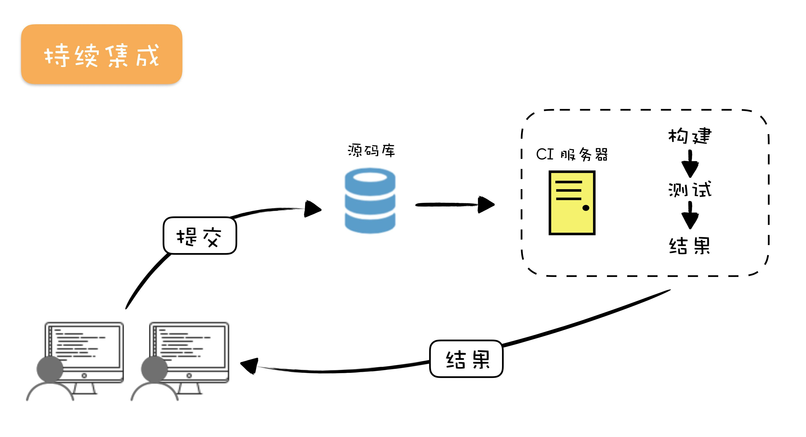

# react-with-cicd
本项目只为自己熟悉 `jenkins` 服务的 `cicd`。


## What is CICD?
- `CI` -  **Continuous Integration 持续集成**，包括代码的合并、构建、部署、测试，持续执行该过程并对结果进行反馈。
- `CD` - **Continuous Deployment 持续部署** 到生产环境 (开发环境、测试环境)
- `CD` - **Continuous Delivery 持续交付** 部署到生产环境，供用户使用。
- `DevOps`: 是一个完整的面向 `IT` **运维**的工作流，以 `IT` 自动化以及持续集成（CI）、持续部署（CD）为基础，来优化程式**开发、测试、系统运维**等所有环节



## Jenkins


## 创建 React 项目
```bash
npx create-react-app react-with-cicd
```

## 安装JDK
准备一台服务器，用来部署 `jenkins` 服务
> 提示：可以在 **阿里云** 进行购买，或自行搭建一个 `VMWare` 虚拟机，操作系统为 `Linux` 即可。

阿里云购买
- 选择 实例与镜像 [实例](https://ecs.console.aliyun.com/?spm=5176.2020520114.recommends.decs.58b3558aseYH2X#/server/region/cn-qingdao) 
- 创建实例
- 按量付费
- 选择 centos 操作系统
### 安装 JDK
```bash
cd /usr/local/src
wget http://img.zhufengpeixun.cn/jdk1.8.0_211.tar.gz
tar -xzvf jdk1.8.0_211.tar.gz 
cp -r /usr/local/src/jdk1.8.0_211 /usr/java
rm -rf /usr/bin/java　&&　ln -s /usr/java/jdk1.8.0_211/bin/java /usr/bin/java
```

### 修改配置文件
vi /etc/profile
```bash
JAVA_HOME=/usr/java/jdk1.8.0_211
export CLASSPATH=.:${JAVA_HOME}/jre/lib/rt.jar:${JAVA_HOME}/lib/dt.jar:${JAVA_HOME}/lib/tools.jar
export PATH=$PATH:${JAVA_HOME}/bin
```

### 生效配置
```bash
source /etc/profile
java -version
```

### 安装jenkins
```bash
wget -O /etc/yum.repos.d/jenkins.repo https://pkg.jenkins.io/redhat-stable/jenkins.repo
rpm --import https://pkg.jenkins.io/redhat-stable/jenkins.io.key
yum install -y jenkins
```

### 获取 Jenkins 密码
```bash
/var/lib/jenkins/secrets/initialAdminPassword
```

### 操作
- 默认端口号 8080
admin -> 设置
- 修改源 https://mirrors.tuna.tsinghua.edu.cn/jenkins/updates/update-center.json
- 插件
  - Generic Webhook Trigger
  - publish over ssh
  - nvm wrapper

### 配置 webhook
- 新建任务名可以和项目名同名
  选择一个自由风格的软件项目
- 